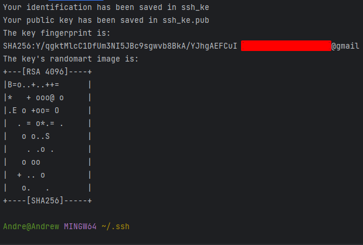

# Setting Up SSH

### This process is terminal specific. Complete this in a terminal you will use git in.

1. Navigate to your folder of choice that you wish to later link to GitHub.
    1. Perform a `git init` in this folder to initialize it as a repo locally.
    2. Ensure you are currently within a git repository (file marked with "main")

2. Begin by navigating to the user directory in the terminal.
   1. This can be done by simply inputting `cd` in the terminal.

    
3. Navigate to the .ssh folder inside the user folder.
   1. Given the security aspect of ssh, the folder is normally hidden. It can be revealed with `ls -al` in the terminal.
   2. If the folder is not there, simply make one. This can be done with `mkdir .ssh`
   3. Following this, cd into the file.

3. Use the following command: `ssh-keygen -t rsa -b 4096 -C <your.email@here.com>git `
   1. The `ssh-keygen` is the command to begin generating a key.
   2. `-t` is the flag for noting the type. In this example we use the type of rsa.
   3. `-b` is the flag for giving the size of the key in bits, here being 4096.
   4. `-C` is the flag for the comment. In most cases, and email is used, as it is here.
   5. If asked for a file name, you may leave this blank, but an automatically generated name will be assigned. It is best practice to give a descriptive name for what this particular key will be used for. In the example given, we have input `ssh_test_1`
   6. You may be asked for a passphrase. This is optional.

4. You will now see the following output:

5. If you use `ls` in the terminal, you can now view the files.

6. From here, you should set up your GitHub SSH key.
   1. Navigate to GitHub.
   2. Click on the top right profile icon, and select Settings.
   3. On the left side, find the `SSH and GPG keys` section within the Access area.
   4. Click the `New SSH Key` button.
   5. Give it an applicable and descriptive name.

7. Navigate back to the terminal. Here we will copy the PUBLIC key from the .ssh directory.
   1. In the terminal, input the following command: `cat <your-file-here.pub> | clip`.
   2. The `| clip`, with the "|" known as pipe, and the "clip" command, serve to copy the result, instead of printing to the terminal.
   2. It is of the highest importance to ensure you only copy the folder named `.pub`. This is the public side of your ssh key, and is the only key that should be seen by others.

8. By doing this, there should be no output in the terminal. 
   1. Take this copied key, and paste it into the key section of the GitHub page.
   2. Make sure at the end of the key, there is no white space.
   3. Then click `Add SSH key`.

9. You have now created and linked your public ssh key to GitHub. Well done.

10. Now it is time to create a small ssh agent so that we can add this newly create private key to our ssh keys in use.
    1. In the terminal, type the command:
    2. eval `ssh-agent`
    2. This should create an agent in the terminal.

11. Now you use the command to add your newly created key to the keychain in use.
    1. In the terminal, type the following:
    2. `ssh-add ~/.ssh/<file-name>`

12. If your identity was successfully added, you can now test the connection to GitHub:
    1. In the terminal, type `ssh -T git@github.com`
    2. the `-T` stands for test.

13. Navigate back to GitHub. Here, you should set up a new repository, ready to be linked.
    1. Once you have set up your fresh repo, navigate to the Code section, and click on the `SSH` button, marked in red here:
    2. After this, within your terminal, navigate to your folder of choice that you initially set up as a local git repository.
    2. Following that, copy the `git remote add origin git@github.com:your_repo/here.git`.
    3. Paste this to the terminal.

15. Then, copy the pasted command to link the repos via ssh:
    1. `git remote set-url origin git@github.com:<your-git/here>.git`
    2. To find your SSH URL, select the SSH button on your repo page, marked in the following image in red.
    3. Use the button on the far right to copy the url. Put this in place of the github SSH url.

16. From here, you should now be able to use your usual git and github commands:
    1. `git add .`
    2. `git commit -m "<your message here>"`
    3. `git push -u origin main`

